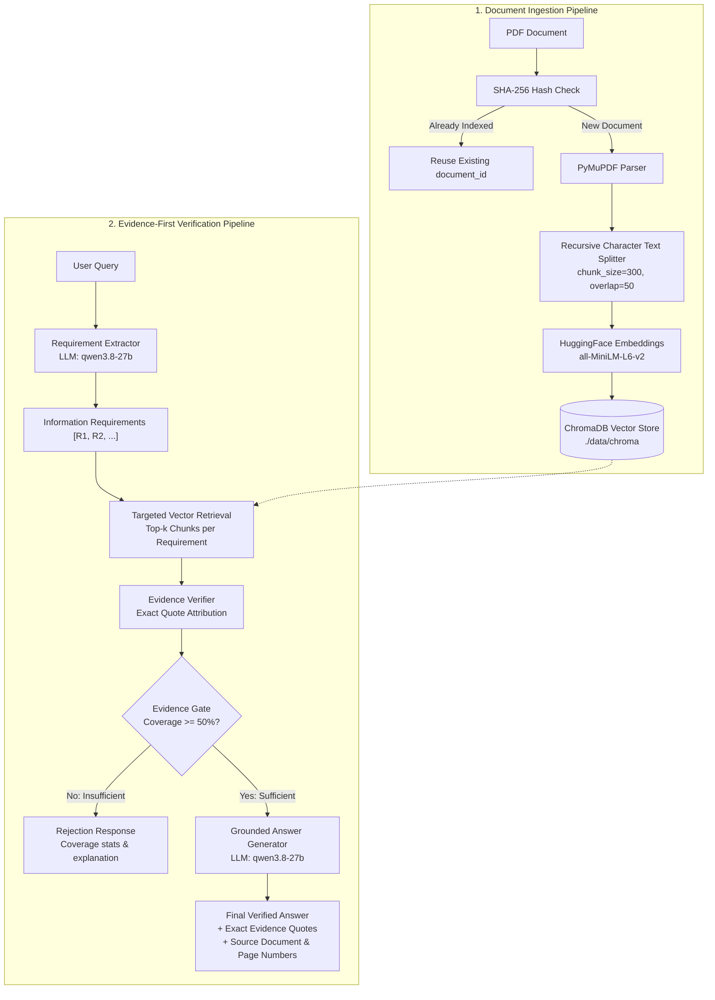

# 🔍 DocLens AI — Evidence-First Document Intelligence

[](https://www.python.org/)
[](https://flask.palletsprojects.com/)
[](https://www.langchain.com/)
[](https://www.trychroma.com/)
[](https://groq.com/)
[](LICENSE)

**DocLens AI** is an enterprise-grade, **evidence-first Retrieval-Augmented Generation (RAG)** platform designed to eliminate hallucinations in question-answering over complex PDF documents. 

Unlike conventional RAG systems that blindly pipe retrieved document chunks into an LLM generator, DocLens AI incorporates an **Information Requirement Extractor**, a **Cross-Verification Engine**, and a **Strict Evidence Gate**. If the retrieved document context fails to substantiate the query's information requirements, the system refuses to speculate—returning transparent coverage statistics and page-level source citations.

---

## 📑 Table of Contents

- [Core Differentiators](#-core-differentiators)
- [System Architecture](#-system-architecture)
- [How It Works: Step-by-Step Pipeline](#-how-it-works-step-by-step-pipeline)
- [Project Structure](#-project-structure)
- [Prerequisites & Requirements](#-prerequisites--requirements)
- [Installation & Setup](#-installation--setup)
- [Environment Configuration](#-environment-configuration)
- [Running the Application](#-running-the-application)
- [API Documentation](#-api-documentation)
- [Evidence Gate & Verification Logic](#-evidence-gate--verification-logic)
- [Running Tests & Benchmarks](#-running-tests--benchmarks)
- [Troubleshooting & FAQs](#-troubleshooting--faqs)

---

## 🌟 Core Differentiators

| Standard RAG | DocLens AI (Evidence-First RAG) |
|---|---|
| Searches the whole question as a single fuzzy vector query | **Deconstructs compound questions** into atomic information requirements |
| Retrieves top-$k$ chunks regardless of relevance | **Targeted sub-retrieval** for each distinct requirement |
| Passes raw chunks directly to the generator | **Verifies exact quote-level evidence** against each requirement |
| Hallucinates plausibly when evidence is missing | **Evidence Gatekeeper**: Rejects answers when evidence coverage is insufficient |
| No explanation of what was missing | **Detailed coverage breakdown**: Supported vs. unsupported requirements with page citations |
| Re-indexes identical files every upload | **SHA-256 fingerprinting**: Instant deduplication without re-embedding |

---

## 🏗️ System Architecture



---

## 🔬 How It Works: Step-by-Step Pipeline

1. **Document Ingestion & Fingerprinting (`document_fingerprint.py`, `document_ingestion.py`)**:
   - Computes a SHA-256 hash of the uploaded PDF before processing.
   - If the file was previously ingested, it reuses the existing `document_id`, avoiding redundant compute and storage.
   - Extracts page-by-page text with `PyMuPDF` preserving page metadata (`page: 1, 2, ...`).
   - Chunks text using `RecursiveCharacterTextSplitter` (chunk size: 300 characters, overlap: 50 characters).

2. **Vector Embeddings & Storage (`vector_store.py`)**:
   - Embeds chunks using **`sentence-transformers/all-MiniLM-L6-v2`** run locally via HuggingFace.
   - No external embedding API calls or embedding rate limits.
   - Stores chunk embeddings with metadata (`document_id`, `file_hash`, `source`, `page`) in a persistent **ChromaDB** collection (`doclens_documents`).

3. **Requirement Extraction (`requirement_extractor.py`)**:
   - Parses the user's question into discrete, atomic requirements using Groq LLM (`qwen/qwen3.8-27b`).
   - Compound queries (e.g., *"What is a README file and what sections should it include?"*) are decomposed into separate verification requirements.

4. **Targeted Sub-Requirement Retrieval (`requirement_retriever.py`)**:
   - Performs individual semantic similarity searches for each extracted requirement filtered by `document_id`.

5. **Evidence Evaluation & Exact Quote Verification (`evidence_verifier.py`)**:
   - Evaluates whether the retrieved passages explicitly support each requirement.
   - Formats results into structured JSON with `"status": "SUPPORTED" | "NOT_SUPPORTED"` and extracts the verbatim supporting quote.

6. **Evidence Gating (`evidence_gate.py`)**:
   - Calculates the **Requirement Coverage Score**:
     $$\text{Coverage} = \frac{\text{Supported Requirements}}{\text{Total Requirements}}$$
   - If coverage $\ge 50\%$, the gate passes (`SUFFICIENT`).
   - If coverage $< 50\%$, the gate rejects (`INSUFFICIENT`), protecting the user from hallucinated answers.

7. **Grounded Generation (`generator.py`)**:
   - Groq LLM produces the final answer strictly bound to the verified evidence items.
   - The response includes structured evidence attributions: requirement text, exact quote, source filename, and page numbers.

---

## 📁 Project Structure

```text
RAG/
├── app.py                         # Flask REST API server and static frontend host
├── requirements.txt               # Python package dependencies
├── .env                           # Environment variables (API keys, settings)
│
├── frontend/                      # Web UI
│   └── index.html                 # Single-page modern dashboard (drag & drop, badges, evidence cards)
│
├── core/
│   ├── document_fingerprint.py    # SHA-256 document hashing for fast deduplication
│   ├── document_loader.py         # PyMuPDF document loading utilities
│   ├── chunker.py                 # RecursiveCharacterTextSplitter implementation
│   ├── document_ingestion.py      # PDF ingestion & metadata binding
│   ├── vector_store.py            # ChromaDB interface with local MiniLM embeddings
│   ├── requirement_extractor.py   # LLM prompt & logic for query decomposition
│   ├── requirement_retriever.py   # Vector retrieval per requirement
│   ├── evidence_evaluator.py      # LLM evaluator for chunk relevance
│   ├── evidence_verifier.py       # Quote-level verification and JSON validation
│   ├── evidence_gate.py           # Evidence sufficiency gatekeeper (coverage threshold)
│   ├── generator.py               # Grounded answer synthesis using verified quotes
│   └── rag_pipeline.py            # Orchestrator linking ingestion, gate, and generation
│
├── testing & benchmarks/
│   ├── test_batch.py              # Automated 8-question batch test suite
│   ├── test_retrieval.py          # Vector retrieval similarity tests
│   ├── debug_evidence.py          # Step-by-step evidence inspection script
│   └── benchmark_ingestion.py     # Ingestion speed and chunking benchmark
│
├── data/
│   └── chroma/                    # Persistent vector database directory
└── uploads/                       # Storage folder for uploaded PDF files
```

---

## 💻 Prerequisites & Requirements

- **Operating System**: Windows, macOS, or Linux
- **Python**: Version `3.10`, `3.11`, or `3.12`
- **Groq API Key**: Free tier or paid key from [Groq Console](https://console.groq.com/)
- **Hardware**: Any modern CPU (MiniLM embeddings run locally with minimal memory footprint)

---

## 🚀 Installation & Setup

### 1. Clone or Open the Repository
```bash
git clone https://github.com/your-username/doclens-ai.git
cd doclens-ai
```

### 2. Create a Virtual Environment
```bash
# Windows (PowerShell)
python -m venv .venv
.\.venv\Scripts\Activate.ps1

# macOS / Linux
python3 -m venv .venv
source .venv/bin/activate
```

### 3. Install Dependencies
```bash
pip install --upgrade pip
pip install -r requirements.txt
```

---

## ⚙️ Environment Configuration

Create a `.env` file in the root directory:

```env
# Groq API Key (required for LLM generation, requirement extraction, and verification)
GROQ_API_KEY=gsk_your_groq_api_key_here
```

> **Note**: Embeddings are calculated locally using `sentence-transformers/all-MiniLM-L6-v2`, requiring no external embedding API keys.

---

## 🖥️ Running the Application

### 1. Start the Flask Server
Run the Flask server:
```bash
python app.py
```

Output:
```text
 * Serving Flask app 'app'
 * Debug mode: on
 * Running on http://127.0.0.1:5000
```

### 2. Open the Web Dashboard
Navigate to **`http://127.0.0.1:5000`** in your browser.

- **Upload Document**: Drag and drop any PDF file. The system will index and report total pages and chunks.
- **Ask Questions**: Enter any single or multi-part question.
- **Inspect Verification**: View the verified answer, evidence coverage percentage, requirement status badges, and source citations with exact page numbers.

---

## 📡 API Documentation

### 1. Health Check
Checks if the backend service is operational.

- **Endpoint**: `GET /health`
- **Response** (`200 OK`):
  ```json
  {
    "status": "ok",
    "message": "DocLens AI backend is running"
  }
  ```

---

### 2. Upload Document
Uploads and indexes a PDF document. If the document was previously uploaded, deduplication recognizes the SHA-256 fingerprint instantly.

- **Endpoint**: `POST /upload`
- **Content-Type**: `multipart/form-data`
- **Form Parameters**:
  - `file`: PDF file binary
- **Response** (`200 OK`):
  ```json
  {
    "status": "success",
    "document_id": "9a5a4b4a-488e-4a38-a171-07160cbc735b",
    "filename": "git_textbook.pdf",
    "pages": 45,
    "chunks": 182,
    "duplicate": false
  }
  ```

---

### 3. Ask Question
Processes a question against an indexed document through the multi-stage evidence gate.

- **Endpoint**: `POST /ask`
- **Content-Type**: `application/json`
- **Request Body**:
  ```json
  {
    "document_id": "9a5a4b4a-488e-4a38-a171-07160cbc735b",
    "question": "What is a README file and what sections does it typically contain?"
  }
  ```

- **Response — Sufficient Evidence (`200 OK`)**:
  ```json
  {
    "status": "SUFFICIENT",
    "question": "What is a README file and what sections does it typically contain?",
    "document_id": "9a5a4b4a-488e-4a38-a171-07160cbc735b",
    "answer": "A README.md file is a plain text file written in Markdown that explains what a project is and how to use it...",
    "gate": {
      "supported_requirements": 2,
      "total_requirements": 2,
      "coverage": 1.0
    },
    "evidence": [
      {
        "requirement": "Definition of a README file",
        "evidence": "A README.md file is simply a plain text file, written in a lightweight formatting language called Markdown, that explains what a project is and how to use it.",
        "source": "uploads/git_textbook.pdf",
        "page": 21
      }
    ]
  }
  ```

- **Response — Insufficient Evidence (`200 OK`)**:
  ```json
  {
    "status": "INSUFFICIENT",
    "question": "How do I configure Kubernetes ingress on AWS?",
    "document_id": "9a5a4b4a-488e-4a38-a171-07160cbc735b",
    "answer": "The provided document does not contain enough evidence to answer this question.",
    "gate": {
      "supported_requirements": 0,
      "total_requirements": 2,
      "coverage": 0.0
    },
    "evidence": []
  }
  ```

- **Response — Rate Limit Error (`429 Too Many Requests`)**:
  ```json
  {
    "error": "The AI model rate limit has been reached. Please wait a minute and try again."
  }
  ```

---

## 🛡️ Evidence Gate & Verification Logic

```text
             +----------------------------+
             | User Question Decomposition|
             +--------------+-------------+
                            |
                   Total Requirements: N
                            |
           +----------------+----------------+
           |                                 |
    Requirement 1                     Requirement 2
    (Retrieve Top-K)                  (Retrieve Top-K)
           |                                 |
    LLM Quote Verifier                LLM Quote Verifier
     -> SUPPORTED                      -> NOT_SUPPORTED
           |                                 |
           +----------------+----------------+
                            |
             Supported Requirements: S (e.g., 1)
             Coverage = S / N = 1 / 2 = 0.50 (50%)
                            |
                 [ Coverage >= 0.50 ? ]
                    /              \
                 YES                NO
                 /                    \
     Status: SUFFICIENT         Status: INSUFFICIENT
     Generate Answer            Refuse & Return Coverage
```

- **Coverage $\ge 50\%$**: System synthesizes the answer using only verified evidence snippets.
- **Coverage $< 50\%$**: System refuses to fabricate or guess, returning `INSUFFICIENT` status along with requirement statistics.

---

## 🧪 Running Tests & Benchmarks

DocLens AI includes dedicated testing scripts:

### Batch Multi-Question Test
Tests diverse questions against an uploaded document to verify retrieval, gating, and answer accuracy:
```bash
python test_batch.py
```

### Retrieval Distance Test
Inspects cosine / L2 distance metrics for vector queries:
```bash
python test_retrieval.py
```

### Step-by-Step Evidence Debugger
Inspects the requirement extraction, chunk retrieval, and verification output in real-time:
```bash
python debug_evidence.py
```

---

## ❓ Troubleshooting & FAQs

### 1. `429 Too Many Requests` (Groq API Rate Limit)
- **Cause**: Groq's free tier has per-minute request and token limits. Because DocLens AI performs multi-step verification (requirement extraction + verification + answer generation), high-frequency queries can hit this threshold.
- **Solution**: The backend automatically captures `429` status codes and surfaces a clear message in the UI. Wait 30–60 seconds before submitting another question.

### 2. Embeddings are slow on first run
- **Cause**: HuggingFace downloads the `sentence-transformers/all-MiniLM-L6-v2` model (~80MB) during the first execution.
- **Solution**: Subsequent runs load the cached weights locally in milliseconds with zero internet latency.

### 3. Resetting the Vector Database
- To clear all stored document chunks and start fresh, remove the `./data/chroma` folder:
  ```bash
  # PowerShell
  Remove-Item -Recurse -Force .\data\chroma

  # Bash
  rm -rf ./data/chroma
  ```

---

## 📄 License

This project is licensed under the [MIT License](LICENSE).
